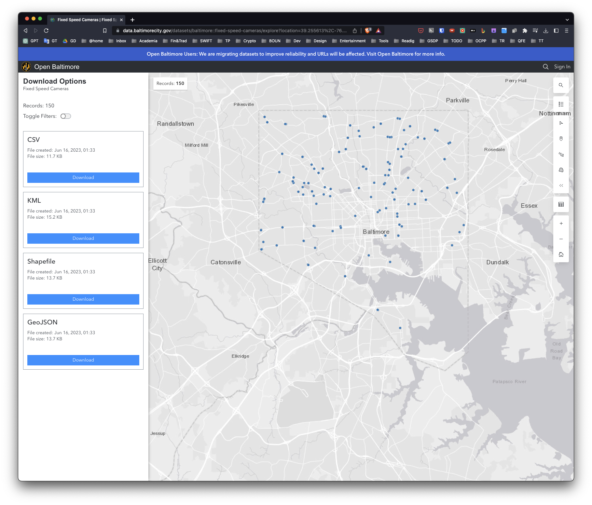
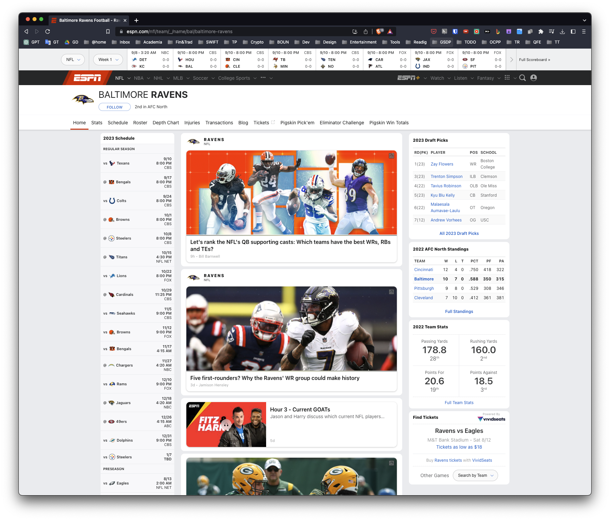
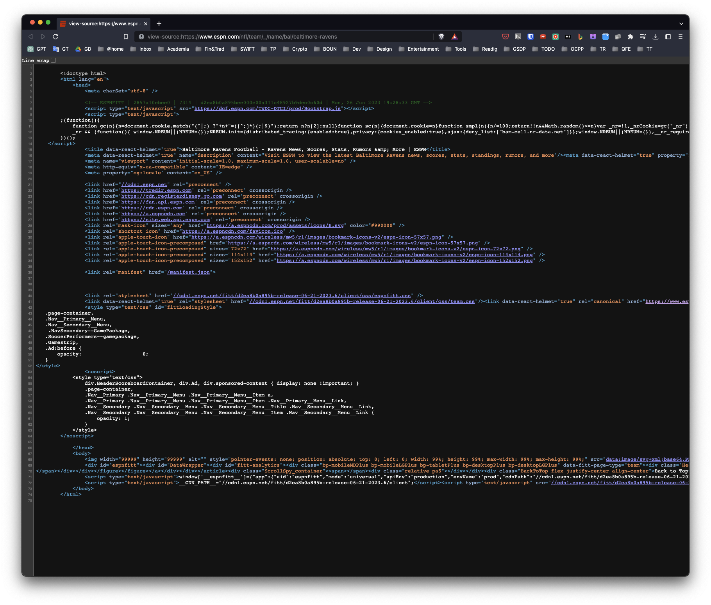

# Week 1


## Obtaining Data Motivation

Contents: 

- Finding and extracting raw data 
- Tidy data principles and how to make tidy data
- Practical implementation through a range of R packages

Purpose: Raw data -> Processing script -> tidy data -> data analysis -> data communication. 


## Raw and Processed Data

Qualitative: Country of origin, sex, treatment
Quantitative: Height, weight, blood pressure

- Raw data:   
  - The original source of data
  - hard to use
  - data analysis includes processing
  - raw data may only need to be processed once
  
- Processed data:   
  - ready for analysis 
  - processing can include merging, subsetting, transforming, etc
  - there may be standards for processing 
  all steps should be recorded 
  
## Components of Tidy Data

This is the target.

### The four things you should have

1. The *raw data*.
2. A *tidy data set*
3. A *code book* describing each variable and its values in the tidy data set.
4. An explicit and exact *recipe* you used to go from 1 -> 2,3.

### The raw data


- The strange binary file your measurement machine spits out
- The unformatted Excel file with 10 worksheets the company you contracted with sent you
- The complicated JSON data you got from scraping the Twitter API
- The hand-entered numbers you collected looking through a microscope


You know the raw data is in the right format if you
1 . Ran no software on the data
2. Did not manipulate any of the numbers in the data
3. You did not remove any data from the data set
4. You did not summarize the data in any way

https://github.com/jtleek/datasharing 

### The tidy data

1. *Each variable* you measure should be in one *column*
2. *Each different observation* of that variable should be in a different *row*
3. There should be one *table for each "kind" of variable*
4. If you have multiple tables, they should include a column in the table that *allows them to be
linked*

Some other important tips
Include a row at the top of each file with variable names.
Make variable names *human readable* AgeAtDiagnosis instead of AgeDx
In general data should be saved in *one file per table*.

### The code book

1. Information about the variables (including units!) in the data set not contained in the tidy data
2. Information about the summary choices you made
3. Information about the experimental study design you used
Some other important tips
A common format for this document is a Word/text file.
There should be a section called "Study design" that has a thorough description of how you
collected the data.
There must be a section called "Code book" that describes each variable and its units.

### The instruction list

Ideally a computer script (in R :-), but I suppose Python is ok too ... )
The input for the script is the raw data
The output is the processed, tidy data
There are no parameters to the script

In some cases it will not be possible to script every step. In that case you should provide instructions
like:
1. Step 1 - take the raw file, run version 3.1.2 of summarize software with parameters a=1, b=2,
C=3
2. Step 2 - run the software separately for each sample
3. Step 3 - take column three of outputfile.out for each sample and that is the corresponding row in
the output data set


## Downloading files

### Get/set your working directory

A basic component of working with data is knowing your working directory
The two main commands are getwd ( ) and setwd ( ) .
Be aware of relative versus absolute paths
- Relative 
- Absolute

Important difference in Windows setwd (c : \\users\ \Andrew\ \Downloads 11 )

### Checking for and creating directories

f i l e . exists 
d i r . create 
Here is an example checking for a "data" directory and creating it if it doesn't exist

```{r}
file.exists("data")
```

```{r}
if(!file.exists("data")){
  dir.create("data")
}
```


### Getting data from the internet - `download.file()`

Downloads a file from the internet
Even if you could do this by hand, helps with reproducibility
Important parameters are `url`, `destfile`, `method`
Useful for downloading tab-delimited, csv, and other files

```{r}
str(download.file)
```

### Example - Baltimore camera data

```{r echo=FALSE, out.width = "50%", fig.align = "center"}

```

```{r}
fileUrl <- "https://opendata.arcgis.com/api/v3/datasets/cc4d3f4c436d4736b121ce781d4f86de_0/downloads/data?format=csv&spatialRefId=2248&where=1%3D1"
download.file(fileUrl, destfile = "./data/cameras.csv", method = "curl")
list.files("./data")
```

### Some notes about download.file()

If the url starts with `http` you can use `download.file()`
If the url starts with `https` on Windows you may be ok
If the url starts with `https` on Mac you may need to set `method="curl"`
If the file is big, this might take a while
Be sure to record when you downloaded.

## Reading local flat files


### Loading flat files - read.tableO

This is the main function for reading data into R
Flexible and robust but requires more parameters
Reads the data into RAM - big data can cause problems
Important parameters file, header, sep, row.names, nrows
Related: read.csv(), read.csv2()


```{r, error=TRUE}
cameraData <- read.table("./data/cameras.csv")
```


```{r, error=TRUE}
cameraData <- read.table("data/cameras.csv", sep = ",", header = TRUE)
```
apparently one or more rows has different number of columns.


### Some more important parameters

quote - you can tell R whether there are any quoted values quote="" means no quotes.
na.strings - set the character that represents a missing value.
nrows - how many rows to read of the file (e.g. nrows=10 reads 10 lines).
skip- number of lines to skip before starting to read

In my experience, the biggest trouble with reading flat files are quotation marks ' or " placed in data
values, setting quote="" often resolves these.

```{r}
str(read.table)
```

## Reading Excel Files

### read.xlsx(), read.xlsx2(), {xlsx package}

```{r, error=TRUE}
library(xlsx)
```
### Reading specific rows and columns 

```{r,error=TRUE}
colIndex <- 2:3
rowIndex <- 1:4
cameraDataSubset <-
  read.xlsx(
    "data/data.xlsx",
    sheetIndex = 1,
    colIndex = colIndex,
    rowIndex = rowIndex
  )
```

### Further notes

- The write.xlsx function will write out an Excel file with similar arguments.
- read.xlsx2 is much faster than read.xlsx but for reading subsets of rows may be slightly unstable.
- XLConnect package has more options for writing and manipulating Excel files.
- XLConnect vignette is a good place to start for that pakkcgae
- In general it is advised to store your data in eigher a database or in a comma seperated files (.csv) or tab separated files (.tab/.txt) as they are easier to distribute.

## Reading XML

### XML

Extensible markup language
Frequently used to store structured data
Particularly widely used in internet applications
Extracting XML is the basis for most web scraping
Components
- Markup - labels that give the text structure
- Content - the actual text of the document

### Tags, elements and attributes

Tags correspond to general labels
- Start tags
- End tags
- Empty tags

Elements are specific examples of tags

- <Greeting> Hello, World </Greeting> 

Attributes are components of the label 

- 
- <step number="3"> Connect A to B. </step>

### Example XML file

```{r,error=TRUE}
library(XML)
xmlURL <- "https://www.w3schools.com/xml/simple.xml"
doc <- xmlTreeParse(xmlURL, useInternal = TRUE)
```
```{r}
xmlURL <- "https://www.w3schools.com/xml/simple.xml"
download.file(xmlURL, destfile = "./data/simple.xml", method = "curl")
list.files("./data")
```


```{r,error=TRUE}
library(XML)
# Parse the XML file
doc <- xmlTreeParse("data/simple.xml", useInternal = TRUE)
doc
```


```{r}
rootNode <- xmlRoot(doc)
rootNode
```

```{r}
xmlName(rootNode)
```
```{r}
names(rootNode)
```

### DIrectly access parts of the XML document 

```{r}
rootNode[[1]]
```


```{r}
rootNode[[1]][[1]]
```

### Programaticallye xtractp artso f the file


```{r}
xmlSApply(rootNode,xmlValue)
```

### XPath

- /node Top level node
- //node Node at any level
- node[@attr-name] Node with an atribute name
- node[@attr-name='bob'] Node with attribute name attr-name='bob 

### Get the items on the menu and prices

```{r}
xpathSApply(rootNode, "//name",xmlValue)
```


```{r}
xpathSApply(rootNode, "//price",xmlValue)
```

### Another example 

```{r echo=FALSE, out.width = "50%", fig.align = "center"}

```
### Viewing the source

```{r echo=FALSE, out.width = "50%", fig.align = "center"}

```

### Extract content by attributes

```{r}
library(RCurl)
webURL <- "https://www.espn.com/nfl/team/_/name/bal/baltimore-ravens"
webData <- getURL(webURL)
doc <- htmlTreeParse(webData, useInternal=TRUE)
scores <- xpathSApply(doc,"/html/body/div[1]/div/div/div/main/div[2]/div[5]/div/div/section/div/div[9]/div[1]",xmlValue)
scores
```

