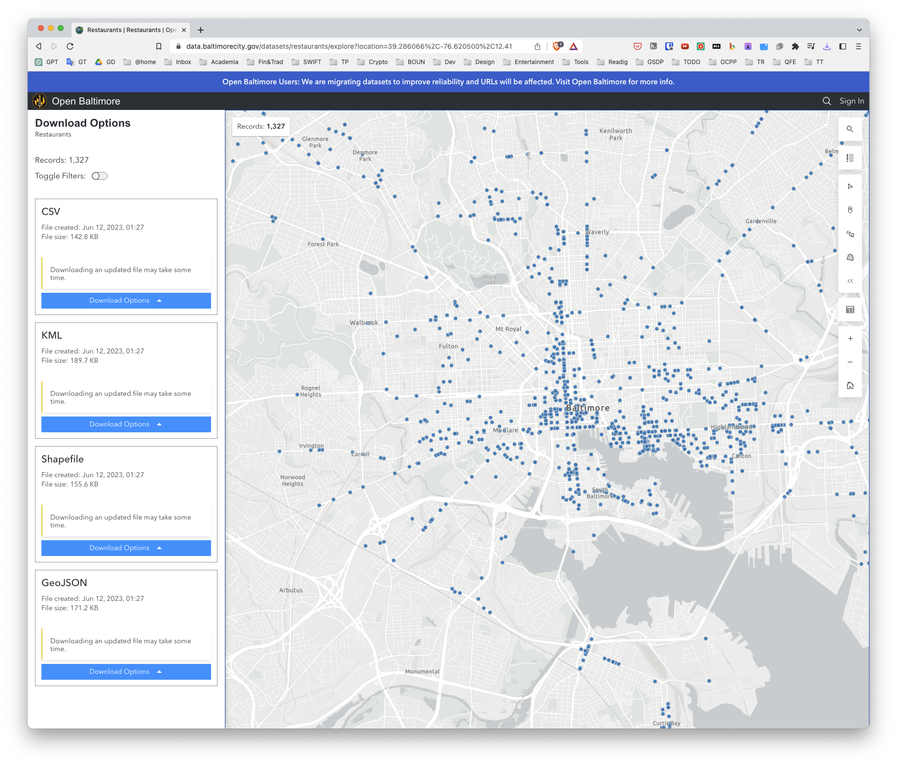

# Summarizing Data

## Example data set

```{r echo=FALSE, out.width = "50%", fig.align = "center"}

```

## Getting the data from the web

```{r}
if(!file.exists("data")) {
  dir.create("data")
}

fileUrl <- "https://opendata.arcgis.com/api/v3/datasets/42f8856d647a41b89561e10fb60bc98a_0/downloads/data?format=csv&spatialRefId=3857&where=1%3D1"

download.file(fileUrl,destfile = "data/rest.csv", method = "curl")
```

```{r}
rest <- read.csv("data/rest.csv")
```


## Look at a bit of the data

```{r}
head(rest)
```

```{r}
tail(rest, n=3)
```

## Make summary

```{r}
summary(rest)
```
## More in depth information

```{r}
str(rest)
```


## Quantileso f quantitativev ariables

```{r}
quantile(rest$cncldst, na.rm = TRUE)
```

```{r}
quantile(rest$cncldst, na.rm = TRUE, probs = c(0.5,0.75,0.9))
```

## Make table

```{r}
table(rest$zipcode, useNA = "ifany")
```

The function `table()` in R is used to create a contingency table (a type of frequency table) from the input data. Here, the `table()` function is being used on the `zipcode` variable in the `rest` dataset.

The `useNA` argument determines how `NA` values (missing values) in the input are handled:

- If `useNA = "no"` (the default), then `NA` values are not included in the table.
- If `useNA = "ifany"`, then `NA` values are included in the table if there are any in the input data.
- If `useNA = "always"`, then `NA` is always included in the table, even if there are no `NA` values in the input data.

So, `table(rest$zipcode, useNA = "ifany")` is creating a frequency table of the `zipcode` variable in the `rest` dataset and including a count of `NA` values if there are any.


```{r}
table(rest$cncldst, rest$zipcode)
```


In this case, table(rest$cncldst, rest$zipcode) is creating a contingency table of the cncldst and zipcode variables in the rest data frame. This table will show how many times each combination of cncldst and zipcode occur in the data.

Each row in the table represents a level of cncldst and each column represents a level of zipcode. The value in each cell in the table represents the number of times that combination of cncldst and zipcode appears in the data frame.

## Check for missing values

```{r}
sum(is.na(rest$cncldst))
```

```{r}
any(is.na(rest$cncldst))
```

```{r}
all(rest$zipcode >0)
```

## Row and column sums

```{r}
colSums(is.na(rest))
```

```{r}
all(colSums(is.na(rest))==0)
```

## Values with specific characteristics

```{r}
table(rest$zipcode %in% c("21212"))
```


```{r}
table(rest$zipcode %in% c("21212","21213"))
```

```{r}
rest[rest$zipcode %in% c("21212","21213"),]
```


## Cross tabs

```{r}
data("UCBAdmissions")
DF <- as.data.frame(UCBAdmissions)
summary(DF)
```


```{r}
xt <- xtabs(Freq ~ Gender + Admit, data=DF)
xt
```

## Flat tables

```{r}
warpbreaks$replicate <- rep(1:9, len = 54)
xt <- xtabs(breaks ~ ., data = warpbreaks)
xt
```

```{r}
ftable(xt)
```

## Size of a data set

```{r}
fakeData <- rnorm(1e5)
object.size(fakeData)
```

```{r}
print(object.size(fakeData), units = "Mb")
```


