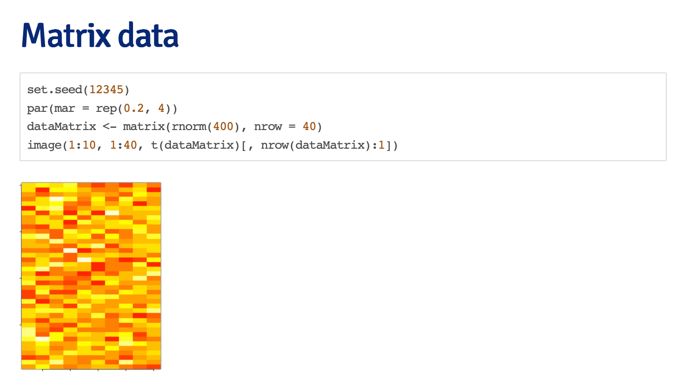
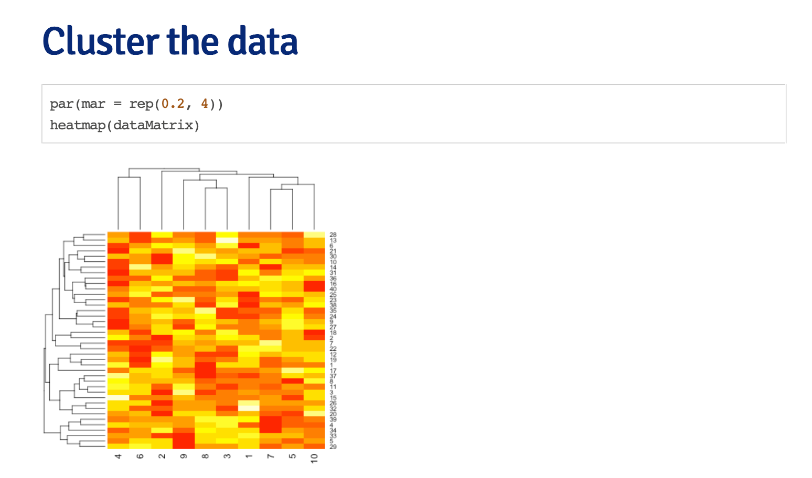

# Principal Components Analysis and Singular Value Decomposition





What if we add a pattern? 

```R
set.seed(678910) 
for (i in 1:40) { # flip a coin
coinFlip <- rbinom(1, size = 1, prob = 0.5)
# if coin is heads add a common pattern to that row if (coinFlip) {
dataMatrix[i, ] <- dataMatrix[i, ] + rep(c(0, 3), each = 5) }
```

