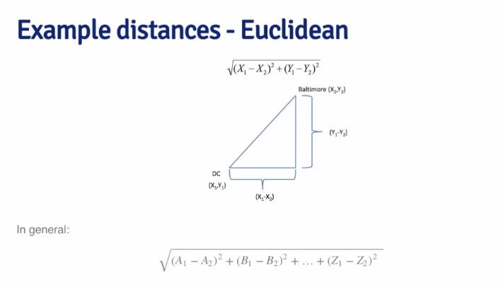
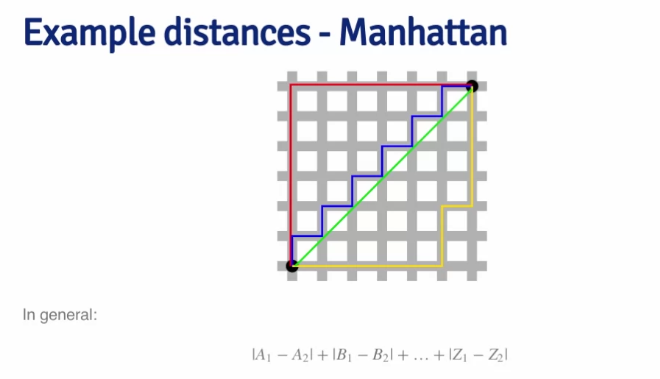
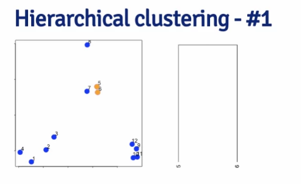
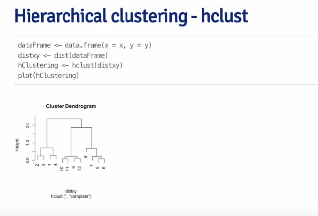
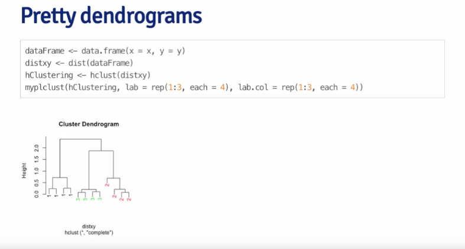

# Hierarchical Clustering 


## Can we find things that are close together ? 

- define close 
- group 
- visualize 
- interpret 

## Hierarchical Clustering

- An agglomerative clustering algorithm
- find closet two 
- put them together
- find next closet 

- requires
  - distance
  - merging approach

- produces 
  - a tree showing how close


## defining close 

- garbage in garbage out 

- Distance or similarity 
  - Euclidean distance
  - Cosine similarity
  - Jaccard similarity
  - Correlation






## dist 

```R
df <- data.frame(x=x,y=y)
dist(df)
```

with distance matrix. 







We need to cut the tree then we will know the cluster final tree dendogram

## Prettier dendrogram 
```R
myplclust <- function (hclust, lab=hclust$labels, lab.col=rep(1, length(hclust$labels)), hang=0.1, ...) {
    y <- rep(hclust$height, 2)
    x <- as.numeric(hclust$merge)
    y <- y[which(x < 0)]
    x <- x[which(x < 0)]
    x <- abs(x)
    y <- y[order(x)]
    x <- x[order(x)]
    plot(hclust, labels=FALSE, hang=hang, ...)
    text(x=x, y=y[hclust$order] - 0.1, labels=lab[hclust$order], col=lab.col[hclust$order], srt=90, adj=c(1,0.5), xpd=NA, ...)
}
```



## Merging points approach

- Single linkage
  - distance between closest points
  - sensitive to noise
  - long chains
  - non-globular shapes
- Complete linkage
  - distance between furthest points
  - less sensitive to noise
  - compact clusters
  - globular shapes
- Average linkage
  - average distance between all pairs of points
  - compromise between single and complete linkage
  - less sensitive to noise
  - compact clusters
  - globular shapes
- Ward's method
  - minimize the total within cluster variance
  - compact clusters
  - globular shapes
  - sensitive to outliers
- Centroid method
  - distance between centroids
  - sensitive to outliers
  - non-globular shapes
  - not recommended

