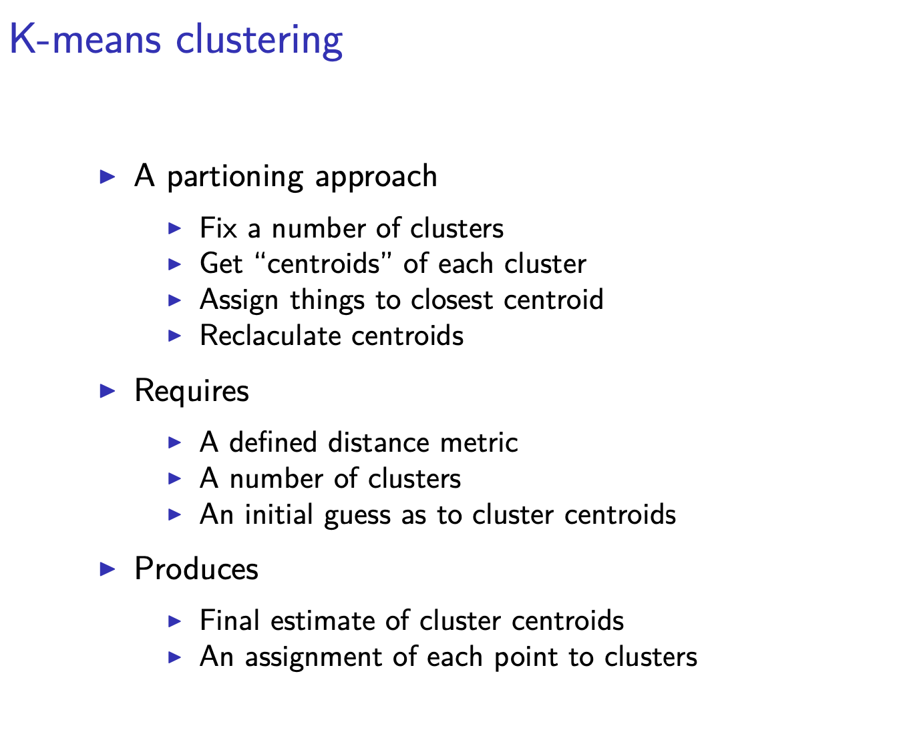

# K-means Clustering

- How do we define close?
- How do we group?
- How do we visualize?
- How do we interpret?




kmeans()

important parameters 

- x 
- centers 
- iter.max
- nstart

k-means clustering example 

```R
dataFrame <- data.frame(x,y)
kmeansObj <- kmeans(dataFrame,centers=3) 
names(kmeansObj)
```

another way to visualize the clustering result is by using heatmap 

```R
set.seed(1234)
dataMatrix <- as.matrix(dataFrame)[sample(1:12),] 
kmeansObj <- kmeans(dataMatrix,centers=3) 
par(mfrow=c(1,2), mar = c(2, 4, 0.1, 0.1)) 
image(t(dataMatrix)[,nrow(dataMatrix):1],yaxt="n") 
image(t(dataMatrix)[,order(kmeansObj$cluster)],yaxt="n
")
```

## Notes and further resources

I K-means requires a number of clusters
I Pick by eye/intuition
I Pick by cross validation/information theory, etc. I Determining the number of clusters
I K-means is not deterministic
I Different # of clusters
I Different number of iterations
I Rafael Irizarry’s Distances and Clustering Video I Elements of statistical learning