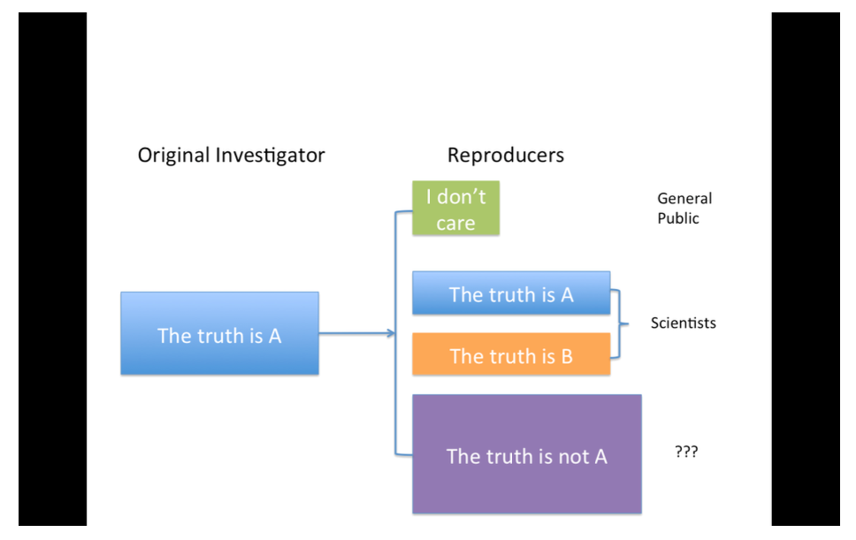

# Reproducible Research Week3 

## Communicating Results

### tl;dr 

· People are busy, especially managers and leaders
· Results of data analyses are sometimes presented in oral form, but often the first cut is presented
via email
· It is often useful to break down the results of an analysis into different levels of granularity / detail
· Getting responses from busy people: http://goo.gl/sJDb9V

### Hierarchy of Information: Research Paper

· Title / Author list
· Abstract
· Body / Results
· Supplementary Materials / the gory details
· Code / Data / really gory details

### Hierarchy of Information: Email

- Subject line / Sender info
  - Ataminimum;includeone
    - Canyousummarizefindingsinonesentence?
· Email body
  - A brief description of the problem / context; recall what was proposed and executed; summarize findings / results; 1–2 paragraphs
  - If action needs to be taken as a result of this presentation, suggest some options and make them as concrete as possible.
  - Ifquestionsneedtobeaddressed,trytomakethemyes/no


· Attachment(s)
    - RMarkdownfile
    - knitrreport
    - Stayconcise;don'tspitoutpagesofcode(becauseyouusedknitrweknowit'savailable)
· Links to Supplementary Materials
    - Code/Software/Data
    - GitHubrepository/Projectwebsite


## Checklist 

### DO: Start With Good Science

· Garbage in, garbage out
· Coherent, focused question simplifies many problems
· Working with good collaborators reinforces good practices
· Something that's interesting to you will (hopefully) motivate good habits


### DON'T: Do Things By Hand

· Editing spreadsheets of data to "clean it up"
    - Removingoutliers 
    - QA/QC
    - Validating
· Editing tables or figures (e.g. rounding, formatting)
· Downloading data from a web site (clicking links in a web browser)
· Moving data around your computer; splitting / reformatting data files
· "We're just going to do this once...."
Things done by hand need to be precisely documented (this is harder than it sounds)

### DON'T: Point And Click

· Many data processing / statistical analysis packages have graphical user interfaces (GUIs)
· GUIs are convenient / intuitive but the actions you take with a GUI can be difficult for others to
reproduce
· Some GUIs produce a log file or script which includes equivalent commands; these can be saved for later examination
· In general, be careful with data analysis software that is highly interactive; ease of use can sometimes lead to non-reproducible analyses
· Other interactive software, such as text editors, are usually fine

### DO: Teach a Computer

· If something needs to be done as part of your analysis / investigation, try to teach your computer to do it (even if you only need to do it once)
· In order to give your computer instructions, you need to write down exactly what you mean to do and how it should be done
· Teaching a computer almost guarantees reproducibilty
For example, by hand, you can
1. Go to the UCI Machine Learning Repository at http://archive.ics.uci.edu/ml/
2. Download the Bike Sharing Dataset by clicking on the link to the Data Folder, then clicking on the link to the zip file of dataset, and choosing "Save Linked File As..." and then saving it to a folder on your computer

Or You can teach your computer to do the same thing using R:

```r
download.file("http://archive.ics.uci.edu/ml/machine-learning-databases/00275/ Bike-Sharing-Dataset.zip", "ProjectData/Bike-Sharing-Dataset.zip")
```
Notice here that
· The full URL to the dataset file is specified (no clicking through a series of links)
· The name of the file saved to your local computer is specified
· The directory in which the file was saved is specified ("ProjectData")
· Code can always be executed in R (as long as link is available)


### DO: Use Some Version Control

· Slow things down
· Add changes in small chunks (don't just do one massive commit)
· Track / tag snapshots; revert to old versions
· Software like GitHub / BitBucket / SourceForge make it easy to publish results

### DO: Keep Track of Your Software Environment

· If you work on a complex project involving many tools / datasets, the software and computing environment can be critical for reproducing your analysis
· Computer architecture: CPU (Intel, AMD, ARM), GPUs,
· Operating system: Windows, Mac OS, Linux / Unix
· Software toolchain: Compilers, interpreters, command shell, programming languages (C, Perl, Python, etc.), database backends, data analysis software
· Supporting software / infrastructure: Libraries, R packages, dependencies
· External dependencies: Web sites, data repositories, remote databases, software repositories
· Version numbers: Ideally, for everything (if available)

### DO: Keep Track of Your Software Environment

```R
sessionInfo()
```

```
> sessionInfo()
R version 4.3.0 (2023-04-21)
Platform: aarch64-apple-darwin20 (64-bit)
Running under: macOS Ventura 13.4.1

Matrix products: default
BLAS:   /System/Library/Frameworks/Accelerate.framework/Versions/A/Frameworks/vecLib.framework/Versions/A/libBLAS.dylib 
LAPACK: /Library/Frameworks/R.framework/Versions/4.3-arm64/Resources/lib/libRlapack.dylib;  LAPACK version 3.11.0

locale:
[1] en_US.UTF-8/en_US.UTF-8/en_US.UTF-8/C/en_US.UTF-8/en_US.UTF-8

time zone: Europe/Istanbul
tzcode source: internal

attached base packages:
[1] stats     graphics  grDevices utils     datasets  methods   base     

loaded via a namespace (and not attached):
[1] compiler_4.3.0 tools_4.3.0    knitr_1.43     xfun_0.39 
```

### DON'T: Save Output

· Avoid saving data analysis output (tables, figures, summaries, processed data, etc.), except perhaps temporarily for efficiency purposes.
· If a stray output file cannot be easily connected with the means by which it was created, then it is not reproducible.
· Save the data + code that generated the output, rather than the output itself
· Intermediate files are okay as long as there is clear documentation of how they were created

### DO: Set Your Seed

· Random number generators generate pseudo-random numbers based on an initial seed (usually a number or set of numbers)
- In R you can use the set.seed() function to set the seed and to specify the random number generator to use
· Setting the seed allows for the stream of random numbers to be exactly reproducible
· Whenever you generate random numbers for a non-trivial purpose, always set the seed

### DO: Think About the Entire Pipeline

· Data analysis is a lengthy process; it is not just tables / figures / reports
· Raw data → processed data → analysis → report
· How you got the end is just as important as the end itself
· The more of the data analysis pipeline you can make reproducible, the better for everyone

### Summary: Checklist

· Are we doing good science?
· Was any part of this analysis done by hand?
- Ifso,arethosepartspreciselydocument?
- Doesthedocumentationmatchreality?
· Have we taught a computer to do as much as possible (i.e. coded)?
· Are we using a version control system?
· Have we documented our software environment?
· Have we saved any output that we cannot reconstruct from original data + code?
· How far back in the analysis pipeline can we go before our results are no longer (automatically) reproducible?


## Reproducible Research with Evidence based Data Analysis

### Replication and Reproducibility

Replication
· Focuses on the validity of the scientific claim
· "Is this claim true?"
· The ultimate standard for strengthening scientific evidence
· New investigators, data, analytical methods, laboratories, instruments, etc.
· Particularly important in studies that can impact broad policy or regulatory decisions

Reproducibility
· Focuses on the validity of the data analysis
· "Can we trust this analysis?"
· Arguably a minimum standard for any scientific study
· New investigators, same data, same methods
· Important when replication is impossible

### Background and Underlying Trends

· Some studies cannot be replicated: No time, No money, Unique/opportunistic
· Technology is increasing data collection throughput; data are more complex and high-
dimensional
· Existing databases can be merged to become bigger databases (but data are used off-label)
· Computing power allows more sophisticated analyses, even on "small" data
· For every field "X" there is a "Computational X"

### The Result?

· Even basic analyses are difficult to describe
· Heavy computational requirements are thrust upon people without adequate training in statistics
and computing
· Errors are more easily introduced into long analysis pipelines
· Knowledge transfer is inhibited
· Results are difficult to replicate or reproduce
· Complicated analyses cannot be trusted

### What is Reproducible Research?


### What Problem Does Reproducibility Solve?

What we get
· Transparency
· Data Availability
· Software / Methods Availability
· Improved Transfer of Knowledge


What we do NOT get
· Validity / Correctness of the analysis

An analysis can be reproducible and still be wrong We want to know “can we trust this analysis?” 
Does requiring reproducibility deter bad analysis?

### Problems with Reproducibility

The premise of reproducible research is that with data/code available, people can check each other and the whole system is self-correcting
· Addresses the most “downstream” aspect of the research process – post-publication
· Assumes everyone plays by the same rules and wants to achieve the same goals (i.e. scientific discovery)


### An Analogy from Asthma

 


### Scientific Dissemination Process


### At Biostatistics


### Who Reproduces Research?

 For reproducibility to be effective as a means to check validity, someone needs to do something
- Re-runtheanalysis;checkresultsmatch
- Checkthecodeforbugs/errors
- Tryalternateapproaches;checksensitivity
· The need for someone to do something is inherited from traditional notion of replication
· Who is "someone" and what are their goals?




### The Story So Far

· Reproducibility brings transparency (wrt code+data) and increased transfer of knowledge
· A lot of discussion about how to get people to share data
· Key question of "can we trust this analysis?" is not addressed by reproducibility
· Reproducibility addresses potential problems long after they’ve occurred ("downstream")
· Secondary analyses are inevitably coloured by the interests/motivations of others 

### Evidence-based Data Analysis

· Most data analyses involve stringing together many different tools and methods
· Some methods may be standard for a given field, but others are often applied ad hoc
· We should apply thoroughly studied (via statistical research), mutually agreed upon methods to analyze data whenever possible
· There should be evidence to justify the application of a given method


· Create analytic pipelines from evidence-based components – standardize it
· A Deterministic Statistical Machine http://goo.gl/Qvlhuv
· Once an evidence-based analytic pipeline is established, we shouldn’t mess with it
· Analysis with a “transparent box”
· Reduce the "researcher degrees of freedom"
· Analogous to a pre-specified clinical trial protocol

### Deterministic Statistical Machine


### Case Study: Estimating Acute Effects of Ambient Air Pollution Exposure

· Acute/short-term effects typically estimated via panel studies or time series studies
· Work originated in late 1970s early 1980s
· Key question: "Are short-term changes in pollution associated with short-term changes in a population health outcome?"
· Studies usually conducted at community level
· Long history of statistical research investigating proper methods of analysis

### Data from New York City


### Case Study: Estimating Acute Effects of Ambient Air Pollution Exposure

· Can we encode everything that we have found in statistical/epidemiological research into a single package?
· Time series studies do not have a huge range of variation; typically involves similar types of data and similar questions
· We can create a deterministic statistical machine for this area?

### DSM Modules for Time Series Studies of Air Pollution and Health

1. Check for outliers, high leverage, overdispersion
2. Fill in missing data? NO!
3. Model selection: `Estimate degrees of freedom` to adjust for unmeasured confounders
· Other aspects of model not as critical 
4. Multiple lag analysis
5. Sensitivity analysis wrt
· Unmeasured confounder adjustment
· Influential points

### Where to Go From Here?

· One DSM is not enough, we need many!
· Different problems warrant different approaches and expertise
· A curated library of machines providing state-of-the art analysis pipelines
· A CRAN/CPAN/CTAN/... for data analysis
· Or a “Cochrane Collaboration” for data analysis

### A Model: Cochrane Collaboration


### A Model: Cochrane Collaboration


### A Curated Library of Data Analysis

· Provide packages that encode data analysis pipelines for given problems, technologies, questions
· Curated by experts knowledgeable in the field
· Documentation/references given supporting each module in the pipeline
· Changes introduced after passing relevant benchmarks/unit tests

### Summary

· Reproducible research is important, but does not necessarily solve the critical question of whether a data analysis is trustworthy
· Reproducible research focuses on the most "downstream" aspect of research dissemination
· Evidence-based data analysis would provide standardized, best practices for given scientific
areas and questions
· Gives reviewers an important tool without dramatically increasing the burden on them
· More effort should be put into improving the quality of "upstream" aspects of scientific research

## Caching Computations

### Literate (Statistical) Programming

- An article is a stream of text and code 
- Analysis code is divided into text and code chunks 
- Each code chunk loads data and computes results
- Presentation code formats results (tables, figures, etc)
- Article text explains what is going on
- Literate programs can be weaved to produce a report or tangled to produce machine-readable documents

- Literate programming is general concept that requirs: 
  - A programming language (machine readble)
  - A documentation language (human readble)

Sweave uses Latex and R as the documentation and programming languages 

Sweave was developed by Friedrich Leisch (member of the R Core) and is maintained by R Core

Alternative to Latex / R exists, such as HTML/R and ODF/R 

### Research Pipeline 


### The cacher package for R 

- Add-on package for R 
- Evaluates code written in files and stores intermediate results in a key-value database
- R expressions are given SHA-1 hash values so that changes can be tracked and code reevaluated if necessary 
- "Cacher packages" can be built for distribution
- Others can 'clone' an analysis and evaluate subsets of code or inspect data objects

## Conceptual Model 


### Cloning an Analysis

- Local directories created 
- Source code fiels and metadata are downloaded 
- Data objects are not downloaded by default 
- References to data objects are loaded and corresponding data can be lazy-loaded on demand 


 


## Case Study: Air Pollution

### What Causes PM to be Toxic?

· PM is composed of many different chemical elements
· Some components of PM may be more harmful than others
· Some sources of PM may be more dangerous than others
· Identifying harmful chemical constituents may lead us to strategies for controlling sources of PM

### NMMAPS

· The National Morbidity, Mortality, and Air Pollution Study (NMMAPS) was a national study of the short-term health effects of ambient air pollution
· Focused primarily on particulate matter (PM10 ) and ozone (O3 )
· Health outcomes included mortality from all causes and hospitalizations for cardiovascular and
respiratory diseases
· Key publications
- http://www.ncbi.nlm.nih.gov/pubmed/11098531
- http://www.ncbi.nlm.nih.gov/pubmed/11354823
· Funded by the Health Effects Institute
- RogerPengcurrentlyservesontheHealthEffectsInstituteHealthReviewCommittee

### NMMAPS and Reproducibility

· Data made available at the Internet-based Health and Air Pollution Surveillance System (http://www.ihapss.jhsph.edu)
· Research results and software also available at iHAPSS
· Many studies (over 67 published) have been conducted based on the public data
http://www.ncbi.nlm.nih.gov/pubmed/22475833
· Has served as an important test bed for methodological development

### What Causes Particulate Matter to be Toxic?


http://www.ncbi.nlm.nih.gov/pmc/articles/PMC1665439/
· Lippmann et al. found strong evidence that Ni modified the short-term effect of PM10 across 60 US communities
· No other PM chemical constituent seemed to have the same modifying effect
· To simple to be true?

### A Reanalysis of the Lippmann et al. Study


http://www.ncbi.nlm.nih.gov/pmc/articles/PMC2137127/
· Reexamine the data from NMMAPS and link with PM chemical constituent data
· Are the findings sensitive to levels of Nickel in New York City?

### Does Nickel Make PM Toxic?


· Long-term average nickel concentrations appear correlated with PM risk
· There appear to be some outliers on the right-hand side (New York City)


· Regression line statistically significant (p < 0.01)


· Adjusted regression line (blue) no longer statistically significant (p < 0.31) 


### What Have We Learned?

· New York does have very high levels of nickel and vanadium, much higher than any other US community
· There is evidence of a positive relationship between Ni concentrations and PM10 risk
· The strength of this relationship is highly sensitive to the observations from New York City
· Most of the information in the data is derived from just 3 observations

### Lessons Learned

· Reproducibility of NMMAPS allowed for a secondary analysis (and linking with PM chemical constituent data) investigating a novel hypothesis (Lippmann et al.)
· Reproducibility also allowed for a critique of that new analysis and some additional new analysis (Dominici et al.)
· Original hypothesis not necessarily invalidated, but evidence not as strong as originally suggested (more work should be done)
· Reproducibility allows for the scientific discussion to occur in a timely and informed manner
· This is how science works

## Case Study : High-Throughput Biology

[baggerly.pdf](baggerly.pdf)

## Commentaries on Data Analysis

